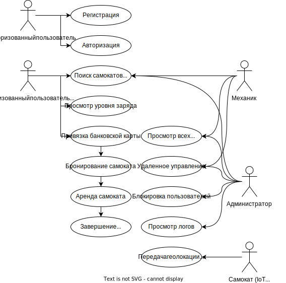
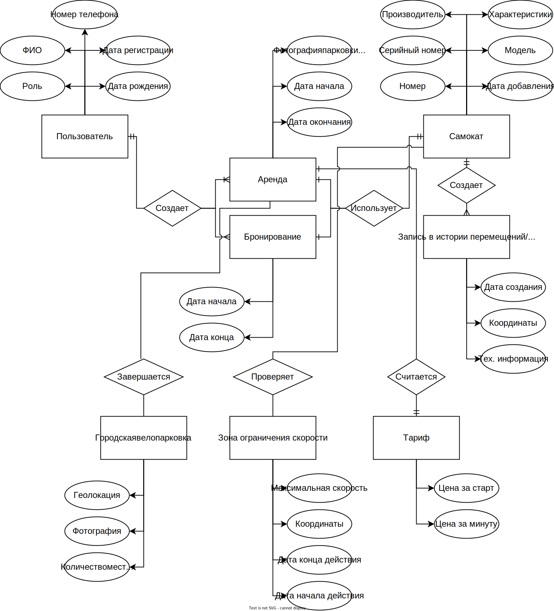
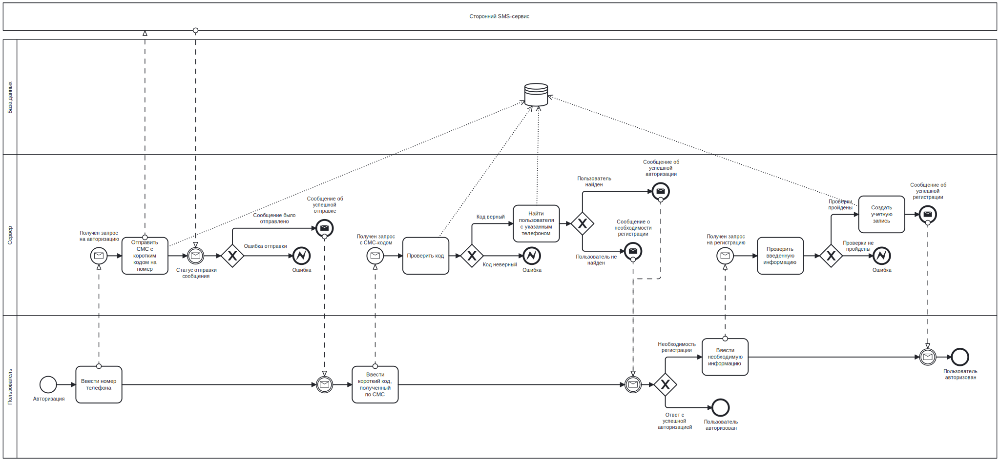
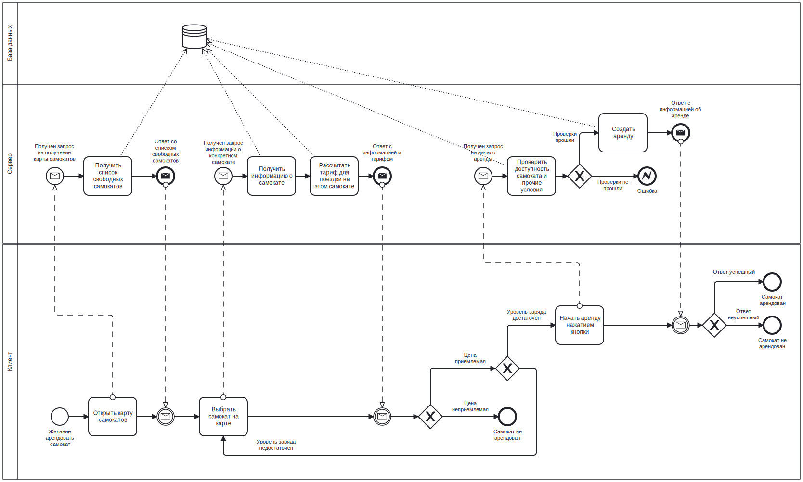
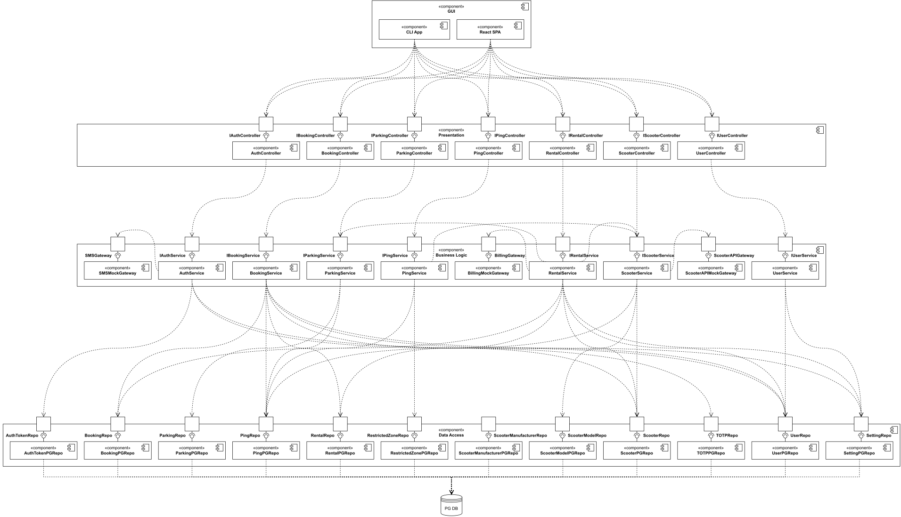

# Название проекта

Сервис краткосрочной аренды городских электросамокатов (кикшеринг)

# Краткое описание идеи проекта

Одностраничное веб-приложение для аренды городских электросамокатов, в котором пользователи могут смотреть расположение электросамокатов на карте, по необходимости бронировать и далее брать их в краткосрочную аренду. Цена поездки вычисляется динамически в зависимости от продолжительности аренды, стоимости проката в минуту и платы за старт. По завершении аренды пользователи отправляют фотографию припаркованного самоката.

# Краткое описание предметной области

Предметной областью является городской транспорт, частью которого являются электросамокаты, так как используют городскую инфраструктуру (в частности велопарковки и велодорожки).

# Краткий анализ аналогичных решений по 3 критериям

|                                  | Whoosh | Юрент | Яндекс Go |
|----------------------------------|:------:|:-----:|:---------:|
| Наличие веб-приложения           |   -    |   -   |     -     |
| Бронирование с любого расстояния |   +    |   -   |     -     |
| Необходимость сканировать QR-код |   ±    |   +   |     -     |

При реализации описываемого проекта будут достигнуты показатели "+" по всем критериям.

# Краткое обоснование целесообразности и актуальности проекта

В последнее время популярность сервисов совместного использования (шеринга) электросамокатов только растет: издание «Трушеринг» [оценило](https://www.forbes.ru/biznes/443899-analitiki-ocenili-ob-em-rynka-kikseringa-v-rossii) рост рынка кикшеринга в 2021 году по сравнению с прошлым годом на 200-230%. Реализация подобного проекта позволит занять часть растущего рынка.

# Use-Case - диаграмма

# ER-диаграмма сущностей

# Пользовательские сценарии

Неавторизованный пользователь:

1. Открыть главную страницу и ввести номер телефона
1. После ввода отправленного на телефон кода перейти на страницу регистрации, если пользователь не существует
1. После ввода отправленного на телефон кода войти в приложение, если пользователь существует

Авторизованный пользователь:

1. Открыть карту с незанятыми самокатами и посмотреть их местоположение в городе
2. Выбрав самокат, посмотреть его уровень заряда и примерное время и расстояние, которое можно на нем проехать
3. Указав реквизиты своей банковской карты, привязать ее к сервису для дальнейшей оплаты аренды
4. Выбрав самокат, забронировать его на установленное время
5. Выбрав самокат, взять его в аренду по предложенной цене за старт и минуту
6. Завершить аренду взятого в прокат самоката и отправить фотографию парковки

Механик:

1. Открыть карту с самокатами, требующими обслуживания, и посмотреть их местоположение в городе
2. Выбрав требующий обслуживания самокат, посмотреть его детальные параметры
3. Выбрав требующий обслуживания самокат, удаленно отправить команду на управление (например, разблокировать батарею для замены)

Администратор:

1. Открыть карту с самокатами и посмотреть их местоположение в городе
2. Выбрав любой самокат, удаленно отправить команду на управление
3. Выбрав пользователя, заблокировать его
4. Посмотреть историю перемещений самокатов
5. Добавить новый самокат в сервис, сделав его доступным для аренды
6. Выбрав любой самокат, исключить его из сервиса, сделав недоступным для аренды

Самокат:

1. Отправить информацию о своем положении на сервер

# Формализация бизнес-правил

# Описание типа приложения и выбранного технологического стека

Планируется создание **Web SPA-приложения** с RESTful бэкендом.

**Стек бэкенда:** TypeScript, Node.js, NestJS, PostgreSQL.\
**Стек фронтенда:** TypeScript, React.

# Верхнеуровневое разбиение на компоненты

# UML диаграммы классов 

